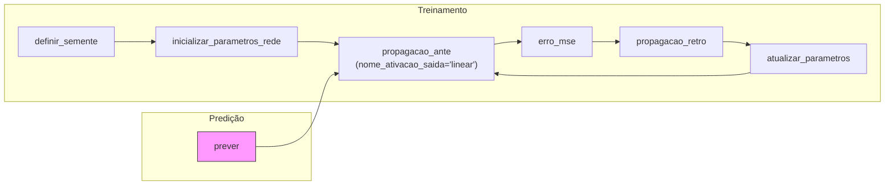
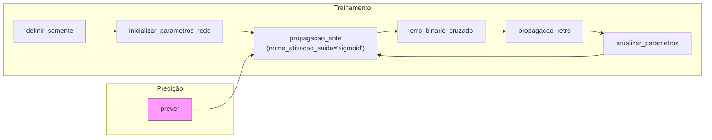
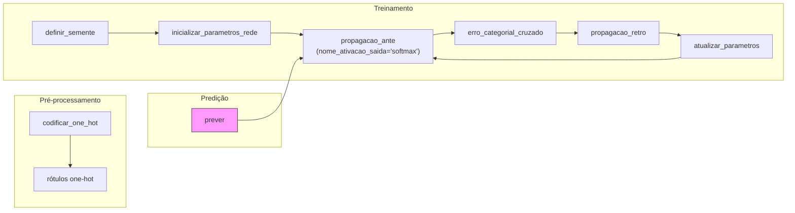

### Regressão

- definir_semente e inicializar_parametros_rede preparam o estado
- propagacao_ante → erro_mse → propagacao_retro → atualizar_parametros formam o laço de treinamento
- prever reutiliza propagacao_ante com saída linear

#### Exemplo
```python
import jax.numpy as jnp
import numpy as np
from src.lib import nn_functional as nn

# X: (n_features, n_amostras), Y: (1, n_amostras)
X = jnp.array(...)  # entrada normalizada
Y = jnp.array(...)  # saída contínua normalizada

# Treinamento
params = nn.treinar_rede(
    matriz_entrada=X,
    matriz_rotulos=Y,
    dimensoes_camadas=(X.shape[0], 16, 8, 1),
    nome_ativacao_oculta="relu",
    nome_ativacao_saida="linear",
    nome_funcao_erro="erro_mse",
    taxa_aprendizado=0.01,
    numero_epocas=1500,
    tamanho_lote=16,
    verbose=True,
)

# Predição
Y_pred = nn.prever(
    X,
    params,
    nome_ativacao_oculta="relu",
    nome_ativacao_saida="linear",
)
```
---
### Classificacao Binaria

- Mesma estrutura, mas com sigmoid na saída e erro_binario_cruzado
- prever aplica threshold em probabilidades geradas por propagacao_ante

#### Exemplo
```python
import jax.numpy as jnp
import numpy as np
from src.lib import nn_functional as nn

# X: (n_features, n_amostras), Y: (1, n_amostras)
X = jnp.array(...)  # seus dados de entrada normalizados
Y = jnp.array(...)  # rótulos binários (0 ou 1), shape (1, m)

# Treinamento
params = nn.treinar_rede(
    matriz_entrada=X,
    matriz_rotulos=Y,
    dimensoes_camadas=(X.shape[0], 64, 32, 1),
    nome_ativacao_oculta="relu",
    nome_ativacao_saida="sigmoid",
    nome_funcao_erro="erro_binario_cruzado",
    taxa_aprendizado=0.01,
    numero_epocas=1000,
    tamanho_lote=32,
    dropout_prob=0.1,
    verbose=True,
)

# Predição
Y_pred = nn.prever(
    X,
    params,
    nome_ativacao_oculta="relu",
    nome_ativacao_saida="sigmoid",
)
```
---
### Classificacao Multiclasse

- Acrescenta codificar_one_hot para preparar Y
- Usa softmax + erro_categorial_cruzado
- prever faz argmax sobre as probabilidades retornadas

#### Exemplo
```python
import jax.numpy as jnp
import numpy as np
from src.lib import nn_functional as nn

# Suponha que temos X e y:
# X: (n_features, n_amostras)
# y: vetor de rótulos inteiros (ex: [0, 2, 1, 0, 3, ...])

X = jnp.array(...)              # dados de entrada normalizados
y_int = np.array([...])         # rótulos inteiros, shape (n_amostras,)
n_classes = len(np.unique(y_int))

# Converte rótulos para one-hot (shape: n_classes x n_amostras)
Y = nn.codificar_one_hot(y_int, numero_classes=n_classes)

# Transpõe X se necessário para ficar (n_features, n_amostras)
X = X if X.shape[0] < X.shape[1] else X.T

# Treinamento
params = nn.treinar_rede(
    matriz_entrada=X,
    matriz_rotulos=Y,
    dimensoes_camadas=(X.shape[0], 64, 32, n_classes),
    nome_ativacao_oculta="relu",
    nome_ativacao_saida="softmax",
    nome_funcao_erro="erro_categorial_cruzado",
    taxa_aprendizado=0.01,
    numero_epocas=1000,
    tamanho_lote=32,
    verbose=True,
)

# Predição
Y_pred = nn.prever(
    X,
    params,
    nome_ativacao_oculta="relu",
    nome_ativacao_saida="softmax",
)

# Rótulos preditos (índice da classe com maior probabilidade)
y_pred = np.array(Y_pred)
```